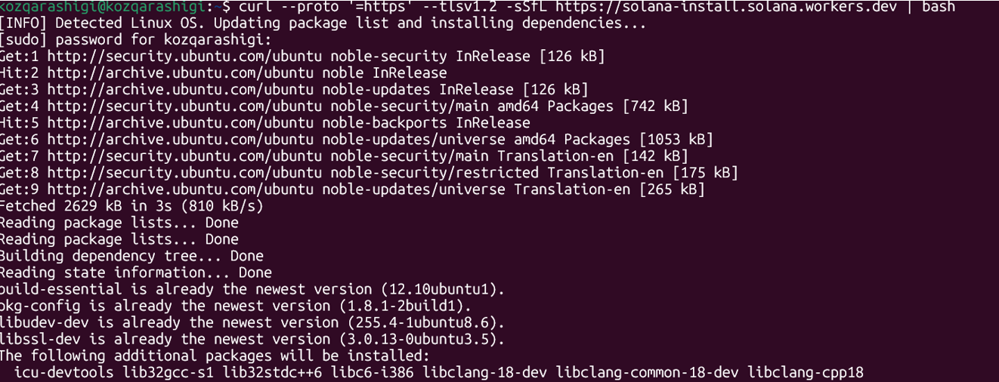
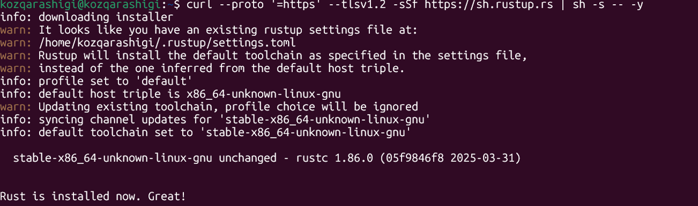
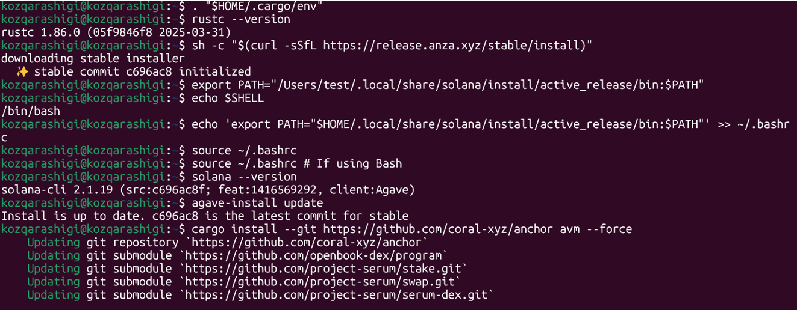
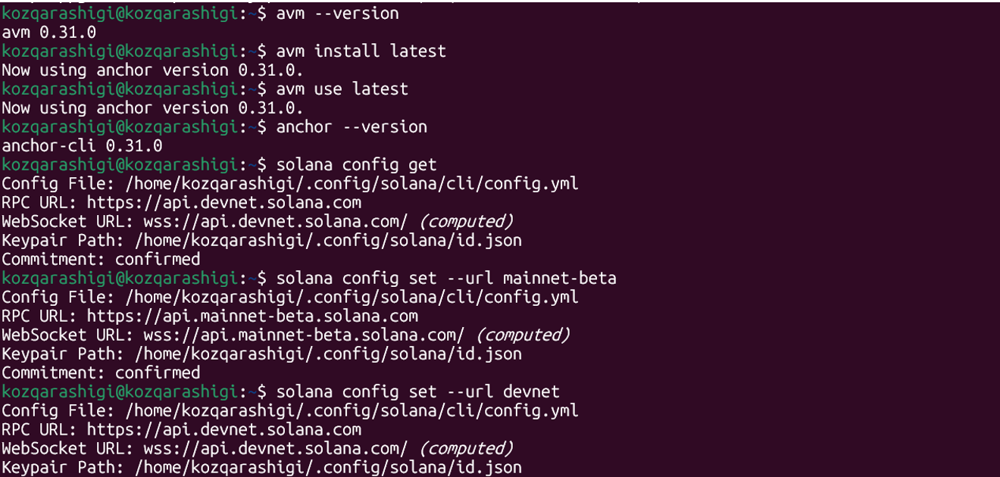
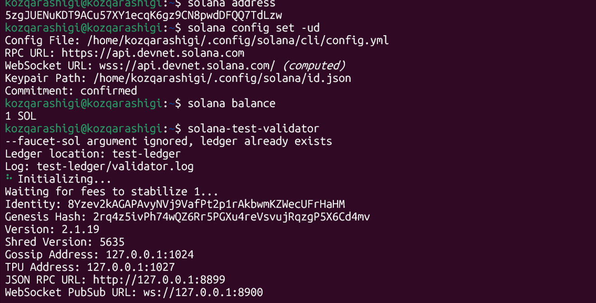
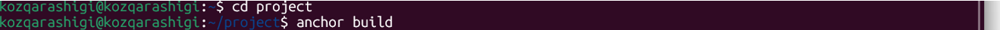
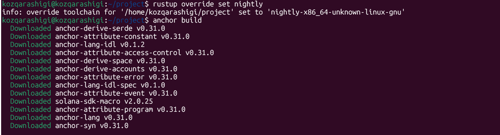

# Solana-Setup-Hello-World-Deployment

This assignment demonstrates:
1. Successful installation of Solana toolchain
2. Development and deployment of a Rust program on Solana

## Documentation Followed
- Installation: [https://solana.com/docs/intro/installation](https://solana.com/docs/intro/installation)
- Rust Program Development: [https://solana.com/ru/docs/programs/rust#update-the-program](https://solana.com/ru/docs/programs/rust#update-the-program)


## Part 1: Solana Installation
### Quick Installation
Run this single command to install all dependencies (due to the that we have used Ubuntu terminal):
```bash
curl --proto '=https' --tlsv1.2 -sSfL https://solana-install.solana.workers.dev | bash
```
 

### Install Rust 
Install Rust with rustup. Run the following command to install Rust:
```bash
curl --proto '=https' --tlsv1.2 -sSf https://sh.rustup.rs | sh -s -- -y
```
 
 

### Install Anchor CLI
Anchor is a framework for developing Solana programs. The Anchor framework leverages Rust macros to simplify the process of writing Solana programs.
Install AVM with the following command:
```bash
cargo install --git https://github.com/coral-xyz/anchor avm --force
```
 

### Solana CLI Basics
### Solana Config & Create Wallet
To send transactions using the Solana CLI, you need a Solana wallet funded with SOL.
To generate a keypair at the default Keypair Path, run the following command:
```bash
solana-keygen new
```
To view our wallet's address (public key), run:
```bash
solana address
```
 

### Anchor CLI Basics
### Initialize Project
 
### Build program
 
### Deploy program
 

