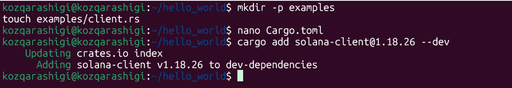

# Solana-Setup-Hello-World-Deployment
## by Tamyzgazina Ulzhan(SE-2325) & Bassanova Nurgul(SE-2323)

This assignment demonstrates:
1. Successful installation of Solana toolchain
2. Development and deployment of a Rust program on Solana

## Documentation Followed
- Installation: [https://solana.com/docs/intro/installation](https://solana.com/docs/intro/installation)
- Rust Program Development: [https://solana.com/ru/docs/programs/rust#update-the-program](https://solana.com/ru/docs/programs/rust#update-the-program)


## Part 1: Solana Installation
### Quick Installation
Run this single command to install all dependencies (due to the that we have used Ubuntu terminal):
```bash
curl --proto '=https' --tlsv1.2 -sSfL https://solana-install.solana.workers.dev | bash
```
 

### Install Rust 
Install Rust with rustup. Run the following command to install Rust:
```bash
curl --proto '=https' --tlsv1.2 -sSf https://sh.rustup.rs | sh -s -- -y
```
 
 

### Install Anchor CLI
Anchor is a framework for developing Solana programs. The Anchor framework leverages Rust macros to simplify the process of writing Solana programs.
Install AVM with the following command:
```bash
cargo install --git https://github.com/coral-xyz/anchor avm --force
```
 

### Solana CLI Basics
### Solana Config & Create Wallet
To send transactions using the Solana CLI, you need a Solana wallet funded with SOL.
To generate a keypair at the default Keypair Path, run the following command:
```bash
solana-keygen new
```
To view our wallet's address (public key), run:
```bash
solana address
```
 

### Anchor CLI Basics
### Initialize Project
 
### Build program
 
### Deploy program
 

## Part 2: Developing Programs in Rust
### Create a new Program
 
Cargo.toml file should look like the following:
 
Replaced the contents of src/lib.rs with the following code. 
 

### Build the Program
 

To view the program ID, run the following command in your terminal. This command prints the public key of the keypair at the specified file path:
 

### Test the Program
 

Add the following test to src/lib.rs, below the program code. This is a test module that invokes the hello world program.


 ### Deploy the Program
 First, configure the Solana CLI to use the local Solana cluster.
```bash
solana config set -ul
```


Open a new terminal and run the solana-test-validators command to start the local validator.
```bash
solana-test-validator
```
While the test validator is running, run the solana program deploy command in a separate terminal to deploy the program to the local validator.
```bash
solana program deploy ./target/deploy/hello_world.so
```


### Invoke the Program
First create an examples directory and a client.rs file.


Add the following to Cargo.toml.


Add the following code to examples/client.rs. This is a Rust client script that funds a new keypair to pay for transaction fees and then invokes the hello world program.


Add the solana-client dependency.


Run the client script with the following command.
```bash
cargo run --example client
```


Test the updated program by running the cargo test-sbf command.
```bash
cargo test-sbf
```


To close a program, use run the following command.
```bash
solana program close DaoRsAj2MJ4ehQukECn5g4NTDV3wbFoYZX8hErdMUBY7
--bypass-warning
```


